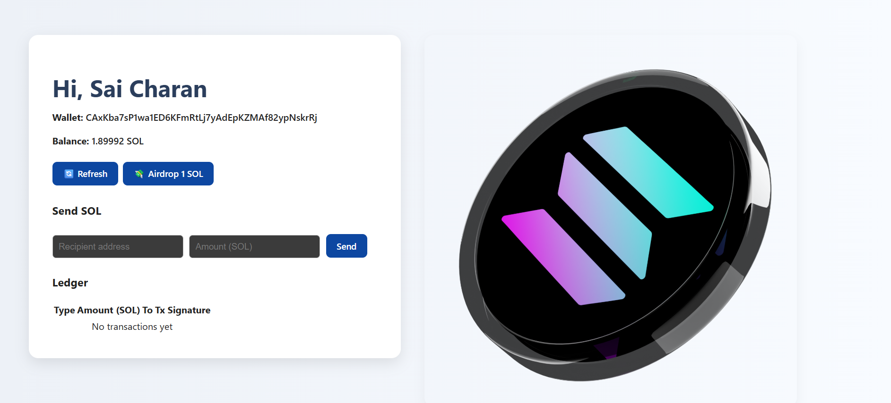

# Solana Wallet dApp

A simple React + Solana Devnet app to:

- Connect Phantom Wallet
- Show SOL balance
- Airdrop 1 SOL (on Devnet)
- Transfer SOL to another address

## 🔗 Live Demo
https://your-vercel-link.vercel.app

## 🛠 Tech Stack
- React
- @solana/web3.js
- Phantom Wallet
- Devnet

## 📸 Screenshots
![Solana Wallet dApp interface showing connected Phantom Wallet, SOL balance, airdrop and transfer buttons, and a modern clean layout with a positive and welcoming tone. The screen displays wallet address, balance in SOL, and buttons labeled Connect Wallet, Airdrop 1 SOL, and Transfer SOL. The background is light with purple and blue accents, evoking a friendly and accessible environment.]

## ⚙️ Run Locally

```bash
npm install
npm run dev
